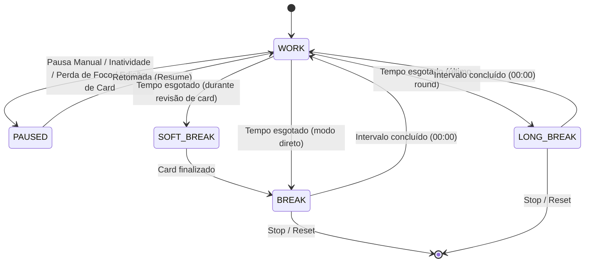
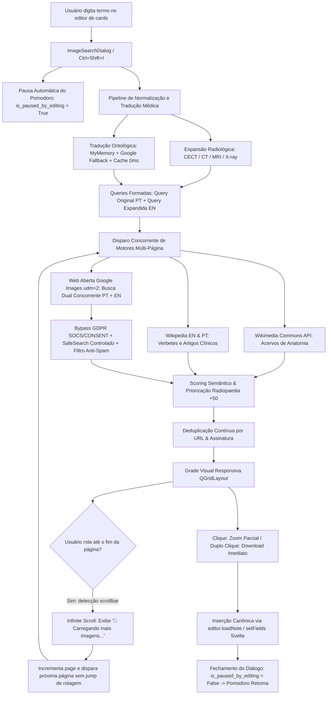

# ⚙️ REGRAS DE NEGÓCIO, MÁQUINAS DE ESTADO & FLUXO (APP_LOGIC.md)
<!-- Especificação técnica e determinística da lógica interna do Obsidian Addon Suite -->

Este documento estabelece as regras de negócio mandatórias, as máquinas de estado, as estratégias de sincronização e a resolução de concorrência entre os módulos do add-on e o ambiente do Anki Desktop.

---

## 1. MÁQUINA DE ESTADOS DO POMODORO (`modules/pomodoro/timer_engine.py`)

O temporizador Pomodoro do Obsidian Addon Suite opera sob uma máquina de estados finita determinística, desenhada para garantir foco absoluto sem penalizar descansos nem rotinas legítimas de edição de cartões.

### 1.1. Estados Primários (`PomodoroState`)
1. `WORK` (Foco Ativo): Contagem regressiva da sessão de estudo (ex: 25 minutos).
2. `SOFT_BREAK` (Pausa Suave / Standby de Conclusão): Intervalo condescendente que aguarda o término do card atual antes de interromper a sessão.
3. `BREAK` (Descanso Curto): Contagem regressiva contínua (ex: 5 minutos).
4. `LONG_BREAK` (Descanso Longo): Contagem regressiva contínua (ex: 15 minutos) após ciclo completo de rounds.
5. `PAUSED` (Pausa Manual / Inatividade / Perda de Foco / Edição): Temporizador estático aguardando condição de retomada.



### 1.2. Flags de Estado & Condições de Pausa

| Flag / Atributo | Gatilho de Ativação | Comportamento no Temporizador | Alarme Sonoro? | Popup de Alerta? | Retomada Automática? |
| :--- | :--- | :--- | :--- | :--- | :--- |
| `paused_for_focus_loss` | Janela do Anki perdeu foco no SO durante `WORK` | Pausado imediatamente | Sim (`digital_alarm.wav`) | Sim (`FocusReminderDialog`) | Não (requer clique em Retomar ou foco de volta) |
| `is_paused_by_inactivity` | Inatividade do mouse/teclado > tempo limite durante `WORK` | Pausado imediatamente | Sim (`bell.wav` / preset) | Não | Sim (ao mover mouse ou pressionar tecla) |
| `is_paused_by_editing` | Abertura do Editor (`gui_hooks.editor_did_init`), Add Cards ou Diálogo de Imagens | Pausado suavemente | **Não** (silencioso) | **Não** (invisível) | **Sim** (ao fechar janela de edição/busca) |

### 1.3. Regras Mandatórias de Intervalos (`BREAK` e `LONG_BREAK`)
* ⚠️ **IMUNIDADE TOTAL A INTERRUPÇÕES**: Durante as fases `BREAK` e `LONG_BREAK`, o temporizador **NUNCA pausa por inatividade** nem por perda de foco.
* O usuário pode minimizar o Anki, usar outros programas ou sair da mesa; o descanso corre ininterruptamente até `00:00`, momento em que o alarme de fim de intervalo é disparado.

---

## 2. ARQUITETURA DO GUARDIÃO DE FOCO ANTI-DEADLOCK (`focus_guard.py`)

O `FocusGuard` opera para impedir distrações do usuário, garantindo que o cronômetro de trabalho reflita apenas o tempo em que o estudante esteve genuinamente no Anki.

### 2.1. Detecção a Nível de Sistema Operacional (Win32 OS-Level)
O Anki renderiza boa parte de sua interface via `QWebEngineView` (Chromium subprocess). O Chromium cria janelas Win32 nativas que interceptam eventos e isolam o foco do Qt. A verificação padrão do Qt (`QApplication.activeWindow()`) frequentemente falha e acusa falso-positivo de perda de foco.

**Solução Anti-Isolamento**:
1. Consulta física direta via `ctypes.windll.user32.GetForegroundWindow()`.
2. Extração do Thread Process ID (`GetWindowThreadProcessId`).
3. Comparação contra a árvore de PIDs do Anki (`os.getpid()`, `QtWebEngineProcess.exe`, `mpv.exe`).
4. Varredura dos nós ancestrais da janela ativa no Windows via `GetAncestor(hwnd, GA_ROOT)` e `GetAncestor(hwnd, GA_ROOTOWNER)`.
5. Se a janela de primeiro plano ou qualquer ancestral pertencer à árvore de processos do Anki, a janela é considerada **ativa** e legítima (latência: ~0.02ms).

### 2.2. Resolução de Parentesco Modal & Prevenção de Modal Lockout
No Qt, a exibição de um diálogo modal com parentesco incorreto ou sobreposição de modais concorrentes pode provocar uma **trava de aplicação (deadlock modal)**:
* Se um diálogo de edição ou busca (`ImageSearchDialog`) estiver aberto como `Qt.WindowModality.ApplicationModal` ou em `exec()`, e o `FocusReminderDialog` tentar disparar vinculado cegamente a `aqt.mw`, ocorre conflito de captura de eventos (*modal grab collision*), travando cliques e entradas de teclado.
* **Mecanismo Anti-Deadlock**:
  - Resolução dinâmica do widget pai: o sistema inspeciona `QApplication.activeModalWidget()`.
  - Se um widget modal já estiver ativo no loop de eventos, o diálogo de lembrete aninha-se a ele ou silencia a exibição visual para não sequestrar o loop modal.
  - A flag `is_paused_by_editing` assegura que a abertura de modais legítimos de edição congele a vigilância agressiva de foco antes mesmo de qualquer trigger disparar.

---

## 3. AUTO-HIDE DE CURSOR MULTI-CAMADA (FULL-SPECTRUM HIDE)

Para sessões imersivas de revisão durante `WORK`, o cursor do mouse é automaticamente ocultado após 2.0 segundos de inatividade:

```
[QCursor.pos() Polling a cada 250ms]
         │
         ├── Movimento detectado ──> Restaura Cursor Visível em todas as 3 camadas
         │
         └── Inativo por ≥ 2.0s durante WORK:
                  │
                  ├── Camada 1: QGuiApplication.setOverrideCursor(BlankCursor)
                  ├── Camada 2: Injeção CSS (* { cursor: none !important; }) nos Webviews
                  └── Camada 3: Win32 user32.SetCursor(0)
```

Durante pausas (`BREAK` e `LONG_BREAK`), o cursor permanece visível continuamente.

---

## 4. PIPELINE DE BUSCA MÉDICA DUAL, EXPANSÃO RADIOLÓGICA & INFINITE SCROLL (`modules/image_search/`)

O buscador de imagens foi arquitetado para resolver dois problemas centrais do estudo médico avançado no Anki:
1. **Assimetria Linguística & Ontologia Radiológica**: Estudantes pesquisam termos em português (ex: *"pancreatite necrotizante tomografia contraste"*), mas a vasta maioria dos acervos globais de ponta (como Radiopaedia, PubMed Central, Kenhub e atlas internacionais) cataloga imagens sob terminologia canônica em inglês (*"necrotizing pancreatitis contrast-enhanced CT"* ou *"CECT"*).
2. **Censura Inadvertida de Patologia (SafeSearch) & Esgotamento Precoce de Resultados**: Motores de busca tradicionais censuram necrose, cortes histopatológicos e vísceras humanas sob filtros de moderação convencionais, além de limitar as respostas a uma única página estática de diagramas livres.

### 4.1. Fluxo do Pipeline de Busca Multilíngue Dual & Concorrência na Web Aberta



### 4.2. Arquitetura do Extrator Web Images (Artigos, Revistas Médicas & Classificações Clínicas)
O buscador na Web Aberta (`search_web_images`) provê acesso irrestrito a artigos científicos, periódicos médicos, tabelas de diretrizes e apresentações clínicas:
* **Acesso Educacional a Imagens Proprietárias e Editoriais**:
  - Plataformas enciclopédicas abertas (como Wikimedia Commons) só aceitam material sob licença livre (Creative Commons / Domínio Público). Por isso, tabelas oficiais de diretrizes diagnósticas (ex: Classificação de Atlanta de Pancreatite, escores de Alvarado, critérios de Ranson) não existem nessas plataformas.
  - O backend Web Images pesquisa a web aberta sem bloqueios de copyright, extraindo tabelas clínicas autênticas, figuras de periódicos renomados (*Radiology*, *RadioGraphics / RSNA*, *AJR*, *Gut*, *The Lancet*, *Nature*) e atlas de estudo para uso estritamente educacional no Anki.
* **Resiliência de Transporte e Ausência de Desafios JS**:
  - Enquanto bots de raspagem no Google Images enfrentam barreiras intransponíveis de JavaScript (`/httpservice/retry/enablejs`) sem navegadores completos, o extrator Web Images nativo opera via requisições HTTP ultrarrápidas (`~0.5s`), sem exigir motor de browser pesado no Anki.
* **Mapeamento de Modalidades Radiológicas & Classificações**:
  - *"fluido peripancreático"*, *"líquido peripancreático"*, *"coleção fluida peripancreática"* ➔ `"peripancreatic fluid collection"`, `"acute peripancreatic fluid collection"`.
  - *"classificação de atlanta"*, *"criterios de atlanta"* ➔ `"revised Atlanta classification"`, `"Atlanta classification pancreatitis"`.
  - *"tomografia com contraste"*, *"tomografia contrastada"* ➔ `"contrast-enhanced CT"`, `"CECT"`.
  - *"ressonância magnética"*, *"rm"* ➔ `"MRI"`, `"magnetic resonance imaging"`.
  - *"tomografia computadorizada"*, *"tc"* ➔ `"CT scan"`, `"computed tomography"`.
  - *"radiografia"*, *"raio-x"*, *"rx"* ➔ `"X-ray"`, `"radiograph"`.
* **Insensibilidade Universal a Acentos (`_strip_accents`)**:
  - Toda decomposição léxica de prefixos médicos (`pancreat`, `peripancre`, `apendic`, `glandul`, `utero`) opera sob normalização NFKD, garantindo que buscas com caracteres acentuados (como em *"peripancreático"*, *"útero"*, *"glândula"*) encontrem seus correlatos clínicos em inglês e na literatura internacional sem falhas de substring.
* **Execução Concorrente Multilíngue**:
  - Em vez de escolher apenas um idioma, o motor despacha requisições concorrentes paralelas para a web com o termo original em português e com a versão expandida canônica em inglês.
  - Os resultados de ambos os fluxos são combinados e ordenados por score de relevância biomédica.
* **Boosting Prioritário para Periódicos e Sociedades Médicas**:
  - Resultados oriundos de `rsna.org`, `ajronline.org`, `radiopaedia.org`, `tadeclinicagem.com.br`, `semanticscholar.org`, `sciencedirect.com` e `slideshare.net` recebem bonificação substancial (`relevance_score + 30 a + 50`), garantindo que diretrizes e tabelas de sociedades oficiais apareçam no topo da grade.

### 4.3. Relaxamento de SafeSearch Médico & Filtro Local Anti-Spam
Motores de busca com moderação rígida censuram peças anatômicas reais, necrose tecidual, gangrena e cirurgias viscerais, confundindo conteúdo educacional médico com nudez ou violência gráfica.
* **SafeSearch Relaxado a Nível de Transporte**:
  - O transporte opera com parâmetros e cabeçalhos desprovidos de restrições arbitrárias de SafeSearch (`safe=images` desprovido de filtros puritanos), permitindo a passagem legítima de necrose pancreática, úlceras, cortes histopatológicos e radiológicos.
* **Filtro de Higiene Local Determinístico**:
  - A segurança e limpeza do ambiente de estudo são garantidas localmente pelo add-on através de:
    1. Lista de domínios maliciosos e boards impróprios (`SPAM_DOMAINS`);
    2. Purga cirúrgica de palavras-chave comerciais, pornográficas e de anime (`ADULT_AND_SPAM_KEYWORDS`);
    3. Rejeição com pontuação severa (`score = -100`), blindando a busca médica sem bloquear patologia humana legítima.

### 4.4. Máquina de Infinite Scroll & Acumulação Contínua na Grade
Para que o estudante navegue continuamente sem interrupções por botões de página ou resets visuais:
* **Detecção Dinâmica de Scrollbar (`QScrollBar.valueChanged`)**:
  - Monitora o scroll vertical da área de visualização (`QScrollArea`).
  - Quando a barra atinge a proximidade do final (`value >= maximum - 80px`), dispara o evento assíncrono de carregamento da próxima página (`page += 1`).
* **Proteção Concorrente (`is_loading_more` e `has_more_results`)**:
  - Bloqueia requisições duplicadas enquanto uma busca de página estiver em trânsito no background thread.
* **Footer Dinâmico Sem Jump de Rolagem**:
  - Um rodapé discreto com `"🔄 Carregando mais imagens..."` é adicionado dinamicamente no final do layout.
  - Conforme novos cards são baixados e instanciados, eles são inseridos antes do footer na grade sem alterar o deslocamento vertical já percorrido pelo usuário, evitando saltos visuais incômodos (*scroll jumping*).
* **Deduplicação de Cards**:
  - Um cache de URLs e identidades de imagem (`seen_urls`) descarta qualquer resultado repetido entre páginas subsequentes antes de instanciar os widgets `ImageCardWidget`.

### 4.5. Roteamento Estrito & Isolamento Determinístico de Motores
A seleção de motores no `ImageSearchDialog` obedece ao princípio de isolamento estrito:
* **Escopo Fechado por Motor**:
  - Ao selecionar especificamente **Google Images**, **Wikimedia Commons**, **Wikipédia Artigos** ou **DuckDuckGo**, a consulta é despachada única e exclusivamente ao backend correspondente.
  - Elimina-se qualquer fallback cruzado silencioso (como invocar Google ao falhar a Wikipédia ou vice-versa), garantindo que a intenção do usuário seja rigorosamente respeitada.
* **Modo Combinado ("Todas as Fontes")**:
  - No modo combinado (`all`), as requisições ocorrem de forma concorrente entre Google Images e os acervos da Wikimedia/Wikipédia.
  - Para termos médicos e radiológicos, o pipeline aplica o rebalanceamento de relevância, priorizando fontes clínicas de alta autoridade (`relevance_score`) e intercalando diagramas anatômicos.
* **Resiliência de Scraping e Tolerância a Variações**:
  - O motor do Google Images opera com análise sintática resiliente sobre os blocos estruturados `AF_initDataCallback` e arrays JSON balanceados.
  - O DuckDuckGo Images utiliza regex atualizado e gerenciamento de token de sessão `vqd` para extração confiável de miniaturas e imagens originais sem bloqueios.

### 4.6. Filtro Anti-Biografia e Anti-Obituário na Wikipédia (`-haswbstatement:P31=Q5`)
Um desafio crônico na busca de imagens médicas em acervos enciclopédicos ocorre com patologias e sinais semiológicos epônimos (ex: *"Doença de Alzheimer"*, *"Linfoma de Hodgkin"*, *"Sinal de Murphy"*, *"Trabalho de Parto"*). Por padrão, a API do MediaWiki tende a pontuar mais alto as biografias de médicos e cientistas históricos do que os próprios verbetes nosológicos, resultando em retratos a óleo, fotos de pessoas falecidas ou lápides em vez de imagens anatômicas, histopatológicas ou clínicas.

* **Injeção do Operador Ontológico Wikidata**:
  - As requisições à API da Wikipédia (`action=query&generator=search`) injetam dinamicamente o operador de busca:
    `-haswbstatement:P31=Q5`
  - No grafo de conhecimento do Wikidata, a propriedade `P31` representa *"instance of"* e o item `Q5` representa *"human"* (ser humano).
  - O operador `-haswbstatement:P31=Q5` força o motor de busca da Wikipédia a ignorar sumariamente verbetes de seres humanos (biografias e obituários), preservando exclusivamente artigos de patologias, técnicas diagnósticas, anatomia e procedimentos cirúrgicos.
* **URLs Canônicas de Artigos**:
  - Assegura-se que o atributo `item.source` para artigos enciclopédicos seja construído como uma URL canônica navegável (`https://{lang}.wikipedia.org/wiki/{title}`), substituindo identificadores internos opacos por links diretos para a leitura do verbete médico.

### 4.7. Rastreabilidade de Evidência & Fluxo de Acesso à Página Web de Origem (`item.source`)
Para estudantes e profissionais de medicina, a imagem deve ser acompanhada de sua contextualização clínica e fonte primária de referência:
* **Persistência da URL de Origem**:
  - Cada item retornado (`ImageResultItem`) carrega no atributo `source` a URL original da página web de publicação (ex: o verbete correspondente da Wikipédia, a página de mídia do Wikimedia Commons ou o domínio médico de publicação indexado pelo Google/DDG).
* **Navegação Externa no Diálogo de Zoom e Cards**:
  - No painel de visualização com zoom (`view_zoom`), é disponibilizado o botão `"🌐 Abrir página da imagem"`, posicionado ao lado dos metadados de resolução.
  - No `ImageCardWidget`, o usuário dispõe de um botão de link direto no rodapé e de opção via menu de contexto de clique direito (`Abrir página original`).
  - O acionamento invoca de forma não-bloqueante `QDesktopServices.openUrl(QUrl(item.source))`, abrindo o navegador padrão do sistema operacional diretamente no artigo, estudo ou atlas de origem sem interferir no ciclo de estudo ou no estado do Pomodoro.

### 4.8. Histórico e Gerenciamento de Imagens Recentes (Aba Recentes - Cache MRU de 15 Imagens)
Para agilizar o fluxo de confecção e enriquecimento de múltiplos flashcards relacionados, o pesquisador de imagens incorpora uma aba dedicada de imagens recentes:
* **Estrutura de Abas (`QTabWidget`)**:
  - O diálogo organiza-se em duas abas principais:
    1. **"🔍 Pesquisa"**: Campo de texto, seletor de motores, status e grade de resultados com infinite scroll;
    2. **"🕒 Recentes (X)"**: Grade 4xN com as últimas até 15 imagens que o usuário utilizou e inseriu nos cartões, com contador dinâmico real no título da aba.
* **Política de Cache MRU (Most Recently Used) & Recarga Forçada de Disco**:
  - O módulo `modules/image_search/recent_manager.py` mantém uma fila estritamente limitada a 15 itens (`MAX_RECENT_IMAGES = 15`).
  - Cada nova imagem inserida com sucesso no card ativo (`_on_download_success`) é automaticamente gravada no topo da fila e a aba recente é atualizada de imediato.
  - A função `get_recent_images(MAX_RECENT_IMAGES, force_reload=True)` lê atomicamente `user_files/recent_images.json`, evitando retenção de cache estático em memória quando ocorrem novas adições.
  - O sistema deduplica ocorrências existentes (por `original_url` e `thumb_url`), movendo itens reutilizados de volta para a primeira posição sem criar duplicatas, aceitando registros válidos que possuam `original_url` ou `thumb_url`.
* **Garantia de Renderização Visual no Qt (`card.show()`)**:
  - Quando novos cards (`ImageCardWidget`) são instanciados dentro de contêineres filhos já visíveis no layout do Qt, o add-on executa `if hasattr(card, "show"): card.show()`, impedindo que os widgets permaneçam ocultos (`isHidden() == True`).
  - Chamadas a `adjustSize()` no contêiner da grade garantem o redimensionamento instantâneo do `QScrollArea`.
* **Loader de Miniaturas Resiliente Multi-Tier no Card**:
  - Em `ImageCardWidget.load_thumbnail_async()`, o carregador adota fallback bidirecional entre `thumb_url` e `original_url`, com cabeçalho `Referer` baseado no host de origem e contexto SSL permissivo para servidores de periódicos médicos com certificados expirados, eliminando falhas falsas de renderização de miniatura (`❌`).
* **Persistência Atômica & Preservação em Atualizações**:
  - O estado do histórico de recentes é gravado em formato JSON atômico no caminho:
    `user_files/recent_images.json`
  - A pasta `user_files/` dentro do diretório do add-on é uma convenção oficial do Anki que garante que arquivos gerados pelo usuário nunca sejam apagados durante a reinstalação ou atualização de versões do add-on.
  - O gerenciador utiliza `threading.RLock()` para suporte total a concorrência reentrante entre threads do Qt, workers assíncronos e suítes de testes automatizados.
* **Paridade Operacional Completa com a Aba de Busca**:
  - Na aba Recentes, o usuário conta com a mesma experiência:
    - **Clique simples**: Abre o painel de zoom completo com metadados de resolução, link da fonte original e botão de download;
    - **Duplo-clique**: Realiza o download e insere a imagem imediatamente no campo ativo do editor, fechando o diálogo;
    - **Retorno transparente**: Ao pressionar "◀ Voltar aos Resultados" ou a tecla `Escape` no zoom, o usuário volta exatamente para a aba de onde partiu, preservando a posição de navegação.

### 4.9. Arquitetura de Download Resiliente Multi-Tier (Zero Erros de Rede)
Para eliminar falhas de download decorrentes de bloqueios anti-hotlinking de sites médicos ou certificados expirados:
* **Tier 1 — Download da Imagem Original em Alta Resolução**:
  - `download_image_bytes` envia cabeçalhos de navegador modernos, cabeçalho de `Referer` baseado no domínio raiz do host (em vez da URL completa do arquivo) e gerencia certificados com fallback para contexto SSL tolerante caso o host médico possua certificado expirado.
* **Tier 2 — Fallback Instantâneo para Miniatura em CDN**:
  - Se a URL original retornar `HTTP 403 Forbidden`, `429 Too Many Requests`, timeout ou erro de DNS, o worker transiciona imediatamente e de forma transparente para a URL de miniatura (`item.thumb_url`).
  - Como as miniaturas são servidas pelas CDNs globais dos motores (Google / Bing / Wikimedia), o download é concluído em frações de segundo (`~0.1s`), garantindo que o usuário nunca seja bloqueado por anti-hotlinking.
* **Tier 3 — Fallback para Cache em Memória (`QPixmap`)**:
  - Se a conexão cair completamente durante a operação, o sistema extrai os bytes do próprio `QPixmap` renderizado em memória na tela de zoom do diálogo, salvando a imagem em disco sem requisição de rede adicional.

### 4.10. Ferramentas de Edição Gráfica (Setas, Círculos e Recorte) e Preservação da Imagem Original no Histórico
Para permitir anotações pedagógicas e clínicas antes da inserção nos cartões, o add-on incorpora o editor modal `ImageEditorDialog` (`modules/image_search/ui/image_editor.py`):
* **Anotações Vetoriais em Resolução Nativa**:
  - **Setas Anatômicas (🏹)**: Traçado de seta direcionada com ponta triangular calculada trigonometricamente (`calculate_arrowhead_points` via `math.atan2`), adaptando o tamanho da ponta proporcionalmente à espessura do traço.
  - **Círculos / Elipses de Destaque (⭕)**: Seleção arrastável com normalização de quadrantes (`normalize_rect_coords`) e suavização anti-aliasing.
  - **Corte Retangular (✂️)**: Seleção por arrasto com overlay translúcido sombreado nas áreas externas ao recorte e borda tracejada em azul (#38bdf8). Ao clicar em "Aplicar Corte", o canvas executa `QPixmap.copy()` nos pixels reais da imagem.
  - **Paleta Clínica**: 5 cores de alto contraste (Vermelho `#ef4444`, Amarelo `#eab308`, Verde `#22c55e`, Azul `#38bdf8`, Branco `#ffffff`) e 4 espessuras de traço (2px, 4px, 6px, 8px).
  - **Pilha de Desfazer (`Ctrl+Z`) & Redefinir**: Histórico completo de estados que permite desfazer qualquer anotação ou corte sucessivamente até restaurar o estado original.
* **Isolamento Rígido entre Card e Histórico de Recentes (Regra Mandatória)**:
  - **No Card do Anki**: O add-on injeta a imagem anotada e recortada (`dialog.result_data`), salvando-a na coleção com sufixo `_edited.jpg`.
  - **No Histórico de Recentes (`user_files/recent_images.json`)**: O add-on persiste exclusivamente o objeto `ImageResultItem` original com sua URL e metadados íntegros, sem setas, círculos ou cortes. Assim, futuras reutilizações da imagem a partir da aba "🕒 Recentes" mantêm a imagem original limpa disponível para novas anotações.
* **Pontos de Acesso na Interface**:
  - Botão `"✏️ Editar e Inserir"` (`btn_edit`) destacado em tom púrpura na barra inferior do painel de zoom.
  - Opção `"✏️ Editar e Inserir"` acessível via menu de contexto de clique direito em qualquer card nas abas de pesquisa e recentes.

---

## 5. INTEGRAÇÃO COM SVELTE E DOM DO ANKI (EDITOR LOADNOTE & FLUSH)

No Anki 24/25, os campos do editor são componentes Svelte isolados em Shadow DOM.
* **Flush Preventivo de Edição (`saveNow(true)`)**:
  - Antes de abrir o diálogo de busca modal, o add-on executa `saveNow(true)` na webview do editor. Isso garante que qualquer texto digitado pelo usuário antes de acionar a busca seja persistido do DOM Svelte para `editor.note.fields` em Python, eliminando perda de texto.
* **Gravação na Coleção com Escape Canônico**:
  - A imagem baixada é persistida no diretório de mídia via `editor.mw.col.media.write_data(desired_name, data)`.
  - A tag `` é formatada e sanitizada via `editor.mw.col.media.escape_media_filenames`.
* **Inserção Atômica & Sincronização Dupla**:
  - O diálogo dispara a inserção via `_insert_into_anki_editor` no momento da confirmação de sucesso do download.
  - O editor reativa a janela mãe (`parentWindow.activateWindow()`), foca a webview e executa `focusField(target_idx)`.
  - O campo é atualizado com garantia de não-duplicação (`fields[target_idx] = f"{current_text}<br>{img_tag}"`).
  - Invocação oficial de `editor.loadNote(focusTo=target_idx)` com `triggerChanges()`, garantindo persistência imediata no SQLite da coleção e renderização visual no Svelte sem race conditions.
